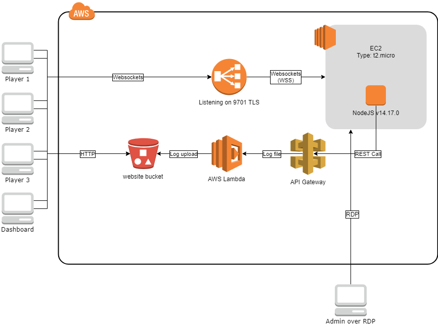

# Libra-Text
Libra Text is a 3-person chat app that is designed to run on AWS, though it can and has been run on other architectures, such as Photon Cloud. 

The client is run from a website hosted on an S3 bucket. The client then connects to the server, and communicates with the other uses by sending JSON text messages relayed by the server.

The server is a NodeJS server on an EC2 instance sitting behind a Load Balancer. As the server files are stored here, below is a list of specs/installs needed for the NodeJS environment:

NodeJS version 14.17.0
Start from main.js
NPM installs needed:
    xmlhttprequest
    websocket

The server runs comfortably on a t2.micro instance, though we have no stats on how many users can run on a server before it needs to be scaled out (though we've run several classes simultaneously with no issues), and there is no code here for scaling. If you do want to scale, it should be relatively simple to write a server that directs users to specific EC2/NodeJS instances that currently handle the room codes entered, and send the client the wss url for that server.

On the backend, the server will send telemetry to an API Gateway which invokes an AWS Lambda call to place telemetry logs in an S3 location. The code for this is not included here, but a better way to do this would be to use the @aws-sdk v3 in NodeJS to directly upload from there.

A dashboard tool is also made available which would sit on the website in a /dashboard/ folder, to be accessed and used by teachers/supervisors. The dashboard will allow for monitoring of speaking statistics, and can flag a set of profanities as well as highlight them in the conversation feeds displayed (the profanity lists are provided- TL;DR: It contains severe profanity).

Both the client and the dashboard tool uses Phaser (Phaser.io) v3.21.0.